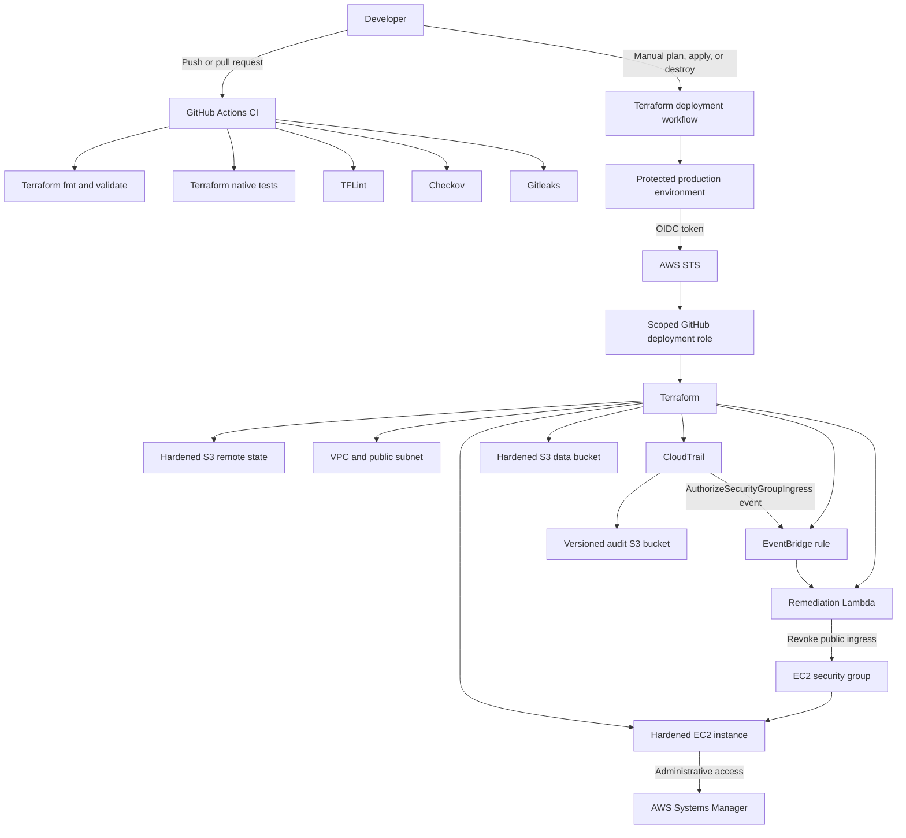

# Secure AWS Hardening Pipeline

A security-focused AWS infrastructure project built with Terraform and GitHub Actions. It demonstrates hardened cloud configuration, secretless CI/CD authentication, remote state protection, infrastructure security testing, audit logging, drift detection, and automatic remediation.

The project was deployed, tested, and completely destroyed after validation to avoid ongoing AWS charges.

## What this project demonstrates

- Modular Terraform architecture
- Secure AWS networking and compute configuration
- GitHub Actions authentication using OIDC instead of access keys
- Protected deployment environments
- Terraform remote state stored in a hardened S3 bucket
- Scoped IAM deployment permissions
- Policy-as-code and secret scanning
- CloudTrail audit logging
- Event-driven security remediation with EventBridge and Lambda
- Native Terraform tests using mocked AWS providers
- Infrastructure drift detection
- Automated and auditable deployment and destruction

## Architecture



## Security controls

### GitHub Actions and AWS authentication

The deployment workflow does not store AWS access keys in GitHub.

GitHub generates a short-lived OIDC token for each deployment. AWS STS validates the token and allows the workflow to assume a dedicated IAM role.

The trust policy restricts access using:

- Audience: `sts.amazonaws.com`
- Repository identity
- Immutable GitHub owner and repository IDs
- Protected GitHub environment: `production`

The expected subject format is:

```text
repo:OWNER@OWNER_ID/REPOSITORY@REPOSITORY_ID:environment:production
```

This prevents workflows from unrelated repositories or environments from assuming the deployment role.

### EC2 hardening

The EC2 module implements:

- No inbound security-group rules
- No SSH key pair
- SSH service disabled through user data
- Administration through AWS Systems Manager
- IMDSv2 required
- Metadata response hop limit set to `1`
- Encrypted `gp3` root volume
- Root volume deleted on termination
- Restricted HTTPS and DNS egress
- Least-privilege access to only the `application/*` S3 prefix
- Amazon Linux 2023 image selected dynamically

The instance receives a temporary public IPv4 address for outbound access to SSM endpoints. No inbound traffic is allowed.

### S3 hardening

The data and audit buckets implement:

- All S3 Block Public Access controls enabled
- ACLs disabled with `BucketOwnerEnforced`
- Default server-side encryption using SSE-S3
- Versioning enabled
- TLS-only bucket policies
- Lifecycle cleanup rules
- Short retention for temporary lab and audit data
- Automatic object removal during lab teardown

The EC2 role can access only the intended application prefix and cannot delete objects.

### Terraform state security

The bootstrap layer creates a dedicated state bucket with:

- S3 Block Public Access
- Bucket-owner-enforced object ownership
- Versioning
- Default encryption
- TLS-only access
- Native S3 state locking
- Noncurrent-version expiration
- `force_destroy = false`

The state bucket is intentionally separated from the application infrastructure so destroying the application does not destroy its state unexpectedly.

### Audit logging

CloudTrail records management events and delivers them to a dedicated audit bucket.

Controls include:

- Log-file validation
- Global service events
- Management read and write events
- Versioned log storage
- TLS-only bucket access
- Restricted CloudTrail bucket policy
- Short lifecycle retention for this temporary lab

### Automatic remediation

CloudTrail records security-group API activity. EventBridge watches for `AuthorizeSecurityGroupIngress` calls against the project security group.

When public IPv4 or IPv6 ingress is detected, Lambda automatically revokes the unsafe rule.

The Lambda execution role is restricted to:

- Writing to its own CloudWatch log group
- Revoking ingress on one specific security group

## Repository structure

```text
.
├── .github/
│   └── workflows/
│       ├── ci.yml
│       └── deploy.yml
├── bootstrap/
│   ├── main.tf
│   ├── outputs.tf
│   ├── providers.tf
│   ├── terraform.tfvars.example
│   ├── variables.tf
│   └── versions.tf
├── environments/
│   └── dev/
│       ├── backend.hcl.example
│       ├── locals.tf
│       ├── main.tf
│       ├── outputs.tf
│       ├── providers.tf
│       ├── terraform.tfvars.example
│       ├── variables.tf
│       └── versions.tf
├── modules/
│   ├── audit/
│   ├── ec2/
│   │   └── tests/
│   ├── network/
│   ├── remediation/
│   │   └── src/
│   └── s3/
│       └── tests/
├── .gitignore
└── .tflint.hcl
```

## CI security pipeline

The CI workflow runs on pushes and pull requests to `main`.

| Check | Purpose | Enforcement |
|---|---|---|
| `terraform fmt` | Enforces consistent Terraform formatting | Blocking |
| `terraform validate` | Validates Terraform syntax and references | Blocking |
| `terraform test` | Tests EC2 and S3 security requirements | Blocking |
| TFLint | Detects Terraform quality and correctness issues | Errors block; warnings remain visible |
| Checkov | Reports infrastructure security findings | Baseline report using `--soft-fail` |
| Gitleaks | Detects committed credentials and secrets | Blocking |

Checkov is currently used as a visible security baseline rather than a hard gate. Findings that result from deliberate lab trade-offs are documented instead of being silently ignored.

## Deployment workflow

The deployment workflow is manually triggered and supports:

- `plan`
- `apply`
- `destroy`

Security properties include:

- `plan` is the safe default
- Only the `main` branch can deploy
- The job references the protected `production` environment
- AWS authentication uses short-lived OIDC credentials
- The assumed AWS identity is verified
- A saved Terraform plan is reviewed before application
- `apply` uses the exact saved plan
- A post-apply plan checks for immediate drift
- Concurrency prevents overlapping deployments

## Prerequisites

- AWS account
- AWS CLI v2
- Terraform 1.15 or later
- Git
- GitHub repository with Actions enabled
- `jq`
- TFLint
- Checkov
- Gitleaks

Configure a local AWS identity with MFA and sufficient permissions to create the bootstrap resources. Do not use AWS root credentials.

## Bootstrap setup

Copy the example variables:

```bash
cp bootstrap/terraform.tfvars.example bootstrap/terraform.tfvars
```

Find the immutable GitHub IDs:

```bash
curl -s https://api.github.com/repos/OWNER/REPOSITORY |
  jq '{owner_id: .owner.id, repository_id: .id}'
```

Configure `bootstrap/terraform.tfvars`:

```hcl
aws_region   = "us-east-1"
project_name = "secure-hardening"

github_owner       = "OWNER@OWNER_ID"
github_repository  = "REPOSITORY@REPOSITORY_ID"
github_environment = "production"
```

Create the bootstrap resources:

```bash
terraform -chdir=bootstrap init
terraform -chdir=bootstrap validate
terraform -chdir=bootstrap plan
terraform -chdir=bootstrap apply
```

Read the outputs:

```bash
terraform -chdir=bootstrap output
```

## GitHub configuration

Create a GitHub environment named:

```text
production
```

Restrict its deployment branches to `main`. Add required reviewers when supported by the repository plan.

Create these GitHub Actions repository variables:

| Variable | Value |
|---|---|
| `AWS_DEPLOY_ROLE_ARN` | Bootstrap `github_deploy_role_arn` output |
| `TF_STATE_BUCKET` | Bootstrap `state_bucket_name` output |
| `AWS_REGION` | `us-east-1` |
| `TF_OWNER` | Resource-owner tag, such as a name or GitHub handle |

No AWS access keys are stored in GitHub.

## Local development configuration

Create the ignored variable file:

```bash
cp environments/dev/terraform.tfvars.example \
  environments/dev/terraform.tfvars
```

Create the ignored backend configuration:

```bash
cp environments/dev/backend.hcl.example \
  environments/dev/backend.hcl
```

Update `backend.hcl` with the bootstrap state-bucket name.

Initialize Terraform:

```bash
terraform -chdir=environments/dev init \
  -reconfigure \
  -backend-config=backend.hcl
```

## Local security checks

Format and validate:

```bash
terraform fmt -check -recursive

terraform -chdir=environments/dev init -backend=false
terraform -chdir=environments/dev validate
```

Run native Terraform tests:

```bash
terraform -chdir=modules/ec2 init -backend=false
terraform -chdir=modules/ec2 test

terraform -chdir=modules/s3 init -backend=false
terraform -chdir=modules/s3 test
```

Run TFLint:

```bash
tflint --init
tflint --recursive
```

Run Checkov:

```bash
checkov \
  --directory . \
  --framework terraform \
  --compact
```

Run Gitleaks:

```bash
gitleaks git .
```

## Deploying

Open the `Terraform deployment` workflow in GitHub Actions.

Run `plan` first and inspect the proposed changes. Then run the workflow again with `apply`.

After deployment, confirm there is no drift:

```bash
terraform -chdir=environments/dev plan -detailed-exitcode
echo $?
```

Expected exit code:

```text
0
```

## Security validation

### Verify EC2 and SSM

```bash
INSTANCE_ID=$(terraform -chdir=environments/dev output -raw instance_id)

aws ec2 describe-instances \
  --instance-ids "$INSTANCE_ID" \
  --query 'Reservations[0].Instances[0].{State:State.Name,IMDS:MetadataOptions.HttpTokens,Monitoring:Monitoring.State}' \
  --output table

aws ssm describe-instance-information \
  --filters "Key=InstanceIds,Values=$INSTANCE_ID" \
  --query 'InstanceInformationList[0].{PingStatus:PingStatus,Platform:PlatformName}' \
  --output table
```

Expected results:

- Instance state is `running`
- IMDS token requirement is `required`
- SSM status is `Online`

### Test automatic remediation

Retrieve the security-group ID:

```bash
SG_ID=$(terraform -chdir=environments/dev output -raw instance_security_group_id)
```

Confirm there is no ingress:

```bash
aws ec2 describe-security-groups \
  --group-ids "$SG_ID" \
  --query 'SecurityGroups[0].IpPermissions'
```

Simulate an unsafe change:

```bash
aws ec2 authorize-security-group-ingress \
  --group-id "$SG_ID" \
  --protocol tcp \
  --port 22 \
  --cidr 0.0.0.0/0
```

After CloudTrail and EventBridge process the event, the Lambda function removes the rule.

Confirm remediation:

```bash
aws ec2 describe-security-groups \
  --group-ids "$SG_ID" \
  --query 'SecurityGroups[0].IpPermissions'
```

Expected result:

```json
[]
```

Review the evidence:

```bash
LOG_GROUP=$(terraform -chdir=environments/dev output -raw remediation_log_group_name)

aws logs tail "$LOG_GROUP" \
  --since 10m \
  --format short
```

## Cost-conscious design decisions

This is a temporary portfolio lab rather than a production platform.

To limit cost, it uses:

- One small EC2 instance
- A single AWS Region
- No NAT Gateway
- No load balancer
- No interface VPC endpoints
- SSE-S3 instead of a customer-managed KMS key
- Basic EC2 monitoring
- Short CloudWatch and S3 retention
- Single-region CloudTrail
- Immediate teardown after testing

Trade-off: the instance uses a public IPv4 address for outbound SSM connectivity. This may incur an hourly public IPv4 charge, but the security group has no inbound rules and SSH is disabled.

A production implementation would likely use private subnets, VPC endpoints, centralized multi-account logging, customer-managed KMS keys, longer retention, alerting, and stricter policy enforcement.

## Teardown

Destroy the application infrastructure through GitHub Actions using the `destroy` operation.

Verify that state is empty:

```bash
terraform -chdir=environments/dev state list
```

The bootstrap state bucket is versioned and uses `force_destroy = false`. To perform a complete teardown, all state versions and delete markers must be removed before destroying the bootstrap layer.

Then run:

```bash
terraform -chdir=bootstrap destroy
```

This removes the state bucket, OIDC provider, deployment role, and deployment policy.

After complete bootstrap teardown, the GitHub deployment workflow will no longer work until the bootstrap layer is recreated.

## Threat model summary

| Threat | Mitigation |
|---|---|
| Long-lived AWS credentials leaked from GitHub | OIDC and short-lived STS credentials |
| Unauthorized repository assumes AWS role | Immutable repository identity in trust policy |
| Unapproved branch deploys infrastructure | Protected environment and `main` restriction |
| Public SSH exposure | No ingress, no key pair, SSH disabled |
| EC2 metadata credential theft | IMDSv2 and hop limit of `1` |
| Public S3 exposure | Block Public Access and TLS-only policies |
| S3 object loss | Versioning and lifecycle controls |
| Overprivileged instance access | Prefix-scoped S3 IAM policy |
| Public security-group rule added | CloudTrail, EventBridge, and Lambda remediation |
| Terraform state exposure | Dedicated encrypted, versioned state bucket |
| Configuration drift | Post-apply and local detailed-exit-code plans |
| Committed credentials | Gitleaks in CI |

## Results

The project was successfully validated end-to-end:

- CI security workflow completed
- GitHub assumed AWS permissions through OIDC
- Terraform deployed using remote state
- EC2 required IMDSv2
- SSM connected without inbound SSH
- S3 hardening controls were verified
- CloudTrail delivered logs and digest files
- A simulated public ingress rule was automatically revoked
- Terraform reported no configuration drift
- Application and bootstrap infrastructure were completely destroyed

## Skills demonstrated

- AWS IAM and STS
- GitHub Actions OIDC federation
- Terraform modules, state, testing, and validation
- Amazon VPC and EC2 security
- AWS Systems Manager
- Amazon S3 security
- AWS CloudTrail
- Amazon EventBridge
- AWS Lambda
- Amazon CloudWatch Logs
- Policy-as-code
- Secret scanning
- Automated remediation
- Infrastructure lifecycle and cost management

## Future improvements

- Make Checkov a blocking gate after documenting accepted exceptions
- Resolve all TFLint module-version warnings
- Add customer-managed KMS keys
- Deploy EC2 into a private subnet using VPC endpoints
- Add CloudWatch alarms and SNS notifications
- Enable multi-region CloudTrail
- Add pull-request plan comments
- Split deployment roles by plan, apply, and destroy privileges
- Add IAM Access Analyzer validation
- Add integration tests in a dedicated temporary AWS account